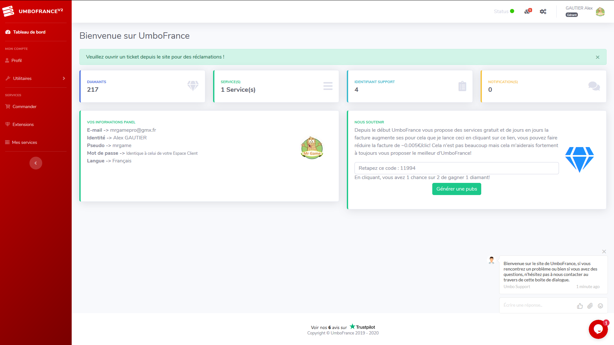
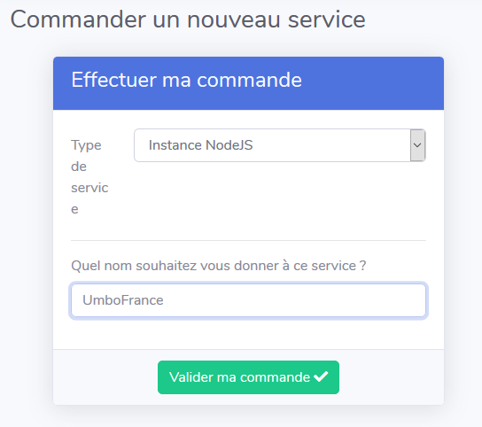
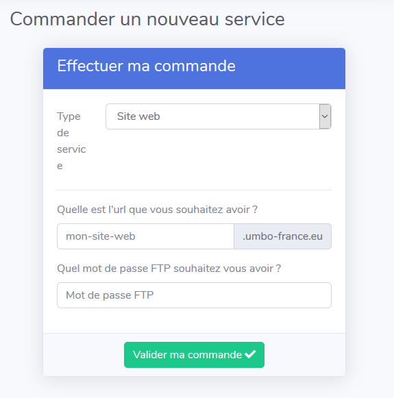

# Accueil

## Commander un service

### Se connecter à l'Espace Client

Pour commander un service gratuit chez UmboFrance, commencez par vous connecter à votre [espace client](https://umbo-france.eu/client). 


Si vous n'avez pas encore de compte, dirigez-vous vers [cette page](https://umbo-france.eu/client/inscription) pour vous inscrire.

* Entrez des prénom et nom **valides**.
* Votre pseudo ne doit pas contenir d'espaces
* Entrez une **adresse mail valide** à laquelle **vous avez accès**.
* Gardez bien soigneusement votre mot de passe, vous en aurez besoin ultérieurement.


Une fois connectés sur l'espace client, vous devriez vous retrouver sur le [tableau de bord](https://umbo-france.eu/client/tableau-de-bord) :

Depuis la sortie de la v2 d'Umbo, vous pouvez désormais commander \(en plus des instances NodeJs pour bots Discord\) :

* des instances Python \(pouvant être utilisées pour des bots Discord en Python\)
* des serveurs Mumble
* des serveurs TeamSpeak
* ou encore des hébergements web.



Pour commander une offre NodeJs, commencez par vous rendre sur le [module de commande de services](https://umbo-france.eu/client/commander). Sélectionnez _Instance NodeJs_ puis, dans le champ prévu à cet effet, choisissez le nom de votre service.

Enfin, cliquez sur_Valider ma commande._

Et voilà, vous avez commandé votre Instance NodeJs. Celle-ci apparaîtra sur la page _Mes services_ dans quelques instants.



Pour commander un hébergement web, commencez par vous rendre sur le [module de commande de services](https://umbo-france.eu/client/commander). Sélectionnez _Site web_.

Deux champs devraient ensuite apparaître :

* Le choix du sous-domaine **.umbo-france.eu** qui vous sera attribué
* Le choix du mot de passe qui sera lié à votre compte [FTP](https://zone.votresite.ca/-/jVM0GRLJgp/).

Vous pouvez ensuite valider votre commande.

Et voilà, vous avez commandé votre hébergement web. Celui-ci apparaîtra sur la page [_Mes services_](https://umbo-france.eu/client/mes-services) dans quelques instants.



