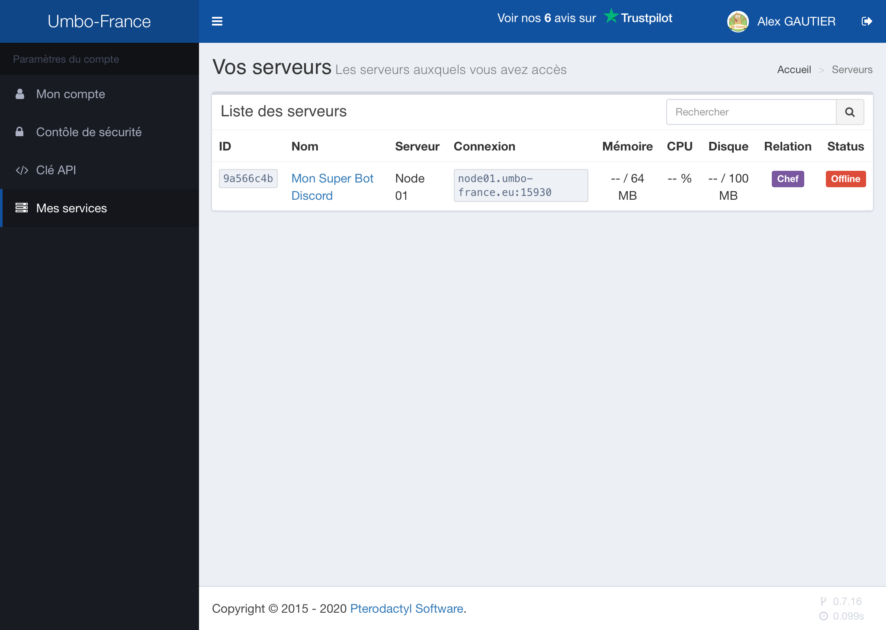

# Gérer son instance NodeJs

Pour accéder à l'interface de gestion de votre Instance NodeJs, rendez vous sur l'onglet [Mes Services](https://umbo-france.eu/client/mes-services). Retenez bien votre identifiant, vous en aurez besoin pour la suite.

Cliquez sur « Gérer mon service » :

Vous devriez être redirigé vers le panel de gestion _pterodactyl_ des serveurs. Si ce n'est pas le cas, [**cliquez ici**](https://panel.umbo-france.eu).

Sans services commandés, le panel devrait ressembler à ça : .

Mais ce que vous devriez avoir à l'écran serait plutôt ça si vous avez commandé un ou plusieurs services :

Voilà, en cliquant sur le nom de votre service, vous avez accès à tout ce dont vous avez besoin pour utiliser votre hébergement :
* Un accès sFTP permettant le transfert de fichiers vers l'instance NodeJs
* Console du serveur
* Boutons d'allumage / extinction du serveur
* Gestionnaire de Fichiers / éditeur de fichiers intégré
* Gestionnaire d'Utilisateurs permattant de travailler à plusieurs sur un même service
* Système d'automatisation des tâches (permettant de programmer une instruction pour plus tard)
* Gestionnaire de bases de données (exceptionnellement si nécessaire pour votre projet

> ⚠ N'oubliez pas de condigurer une commande de démarrage de votre service !
